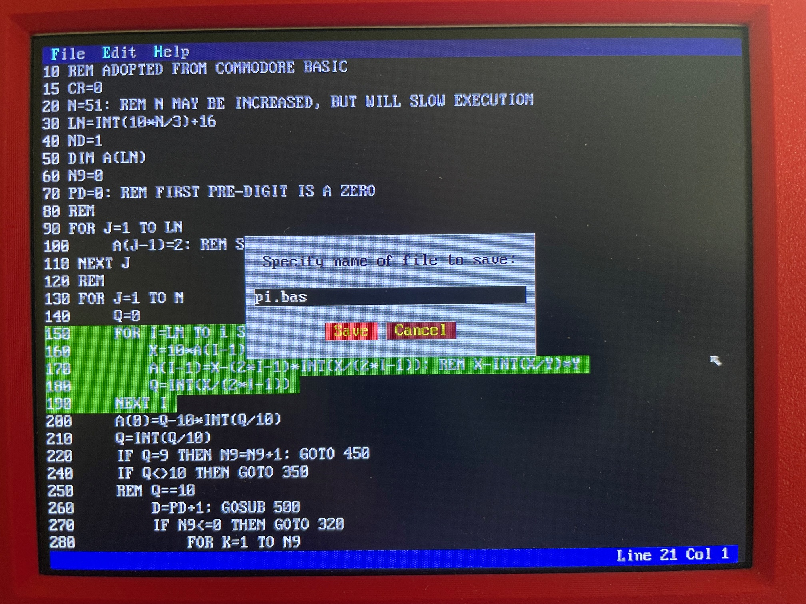

# RP6502-TextEditor
An ASCII text editor for the [Picocomputer 6502](https://picocomputer.github.io/).

 

Currently supports up to 80 columns x 742 lines

This is an LLVM-MOS C project, but a binary build is included for you test out.

Remember that you have to add a .vscode/settings.json file pointing to llvm-install per:
https://github.com/picocomputer/vscode-llvm-mos

